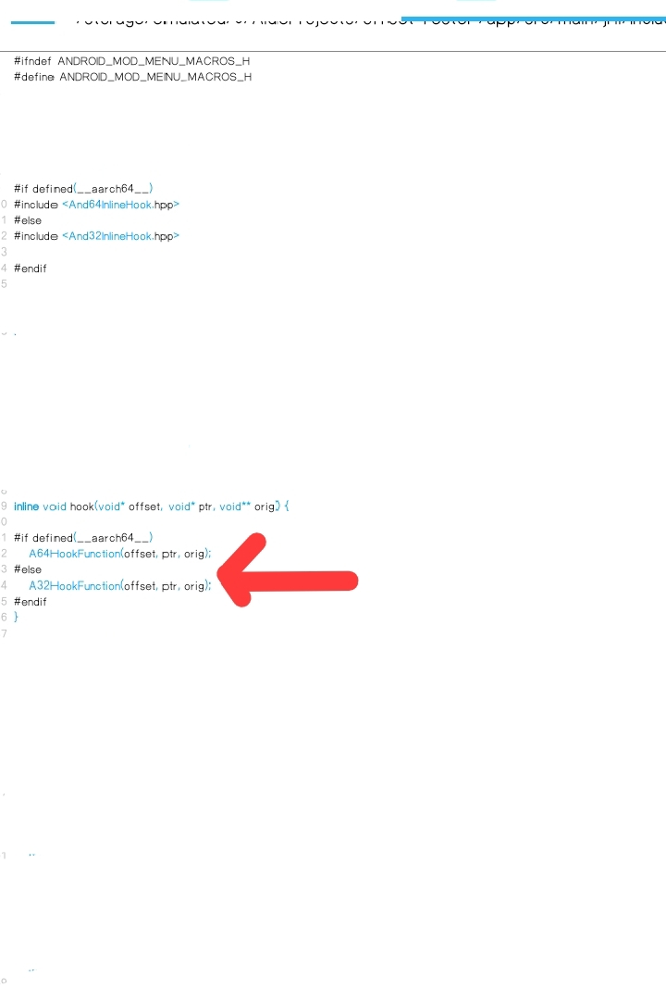

Great! Here’s a draft of a README.md for your And32InlineHook project, complete with badges, a diagram placeholder, detailed sections, and a professional structure. Feel free to adjust links, replace placeholders, and tailor content to your codebase.


---

# And32InlineHook  
  
  
  

> A lightweight inline-hooking library for Android ARM 32-bit, inspired by And64InlineHook, designed to intercept native functions and inject custom logic.

---

## Table of Contents  
1. [Features](#features)  
2. [Why Use And32InlineHook](#why-use-and32inlinehook)  
3. [Getting Started](#getting-started)  
   - [Prerequisites](#prerequisites)  
   - [Building](#building)  
   - [Usage](#usage)  
4. [API Overview](#api-overview)  
5. [Diagram: Hook Flow](#diagram-hook-flow)  
6. [Examples](#examples)  
7. [Limitations](#limitations)  
8. [Contributing](#contributing)  
9. [License](#license)  
10. [Resources & References](#resources--references)  

---

## Features  
- Inline-hooking at runtime (modifies function prologue)  
- Trampoline creation: redirect to custom logic, call original function  
- Specifically optimized for Android **ARM 32-bit** architecture  
- Minimal dependencies and small footprint  
- MIT License: open-source friendly  

---

## Why Use And32InlineHook  
- **Performance**: Inline hooks tend to be faster than alternatives (e.g., PLT/GOT hooks).  
- **Flexibility**: You can hook arbitrary native functions in libraries.  
- **Control**: Redirect execution, intercept parameters, manage hooks programmatically.  
- **Compatibility**: Tailored for 32-bit Android where some hook frameworks focus on ARM64 or include extra overhead.  

---

## Getting Started  

### Prerequisites  
Make sure you have:  
- Android NDK installed  
- A target built for 32-bit ARM (armeabi-v7a)  
- Basic knowledge of native development (C/C++, JNI)  
- If injecting externally, necessary permissions or root access  

### Building  
1. Clone the repository:  
   ```bash
   git clone https://github.com/Magic1-Mods/And32InlineHook.git  
   cd And32InlineHook

2. Build using your preferred toolchain. Example with CMake:

mkdir build && cd build  
cmake -DANDROID_ABI=armeabi-v7a -DCMAKE_TOOLCHAIN_FILE=$NDK/build/cmake/android.toolchain.cmake -DCMAKE_BUILD_TYPE=Release ..  
cmake --build .


3. Include the resulting .so file into your Android / native project or injection system.


Usage

Here’s a conceptual example:

#include "And32InlineHook.h"

// Define original function pointer type
typedef int (*orig_func_t)(int, const char *);
orig_func_t original_function = NULL;

// Hooked function
int my_hooked_function(int arg1, const char *arg2) {
    __android_log_print(ANDROID_LOG_INFO, "And32Hook", "Hooked! arg1=%d arg2=%s", arg1, arg2);
    // Call original
    int result = original_function(arg1, arg2);
    // Optionally change result
    return result + 10;
}

void setup_hook() {
    uintptr_t target_addr = …; // address of function to hook
    original_function = (orig_func_t) InlineHook(target_addr, (uintptr_t) my_hooked_function);
}


---

API Overview

Here are some of the key functions and their purposes (ensure these reflect your actual codebase):

Function	Description

InlineHook(uintptr_t target, uintptr_t new_function)	Installs an inline hook at the address target, and returns a pointer to original/trampoline function.
RemoveHook(uintptr_t target)	Removes a previously installed hook at target.
GetTrampoline(uintptr_t target)	Retrieves the trampoline (original) address for a hooked target (if implemented).


(Update names/parameters to match your actual implementation.)


---

Diagram: Hook Flow

Here is a conceptual flow diagram showing how the hook/trampoline works:



Conceptual Flow:

[Original Function Address]  
      ↓ patch first few bytes  
 [Jump to Custom Function]  
      ↓ optionally call original/trampoline  
 [Restored/Trampolined Original Function]

---

Examples

File I/O Hooking: Hook open(), read() or similar libc native functions to monitor file operations.

Game Modding / Patching: Hook internal functions of a game’s native library to alter behavior, inject asset loading, or custom logic.

Instrumentation / Security Research: Use the hook to intercept certain library calls, monitor arguments/returns, or manipulate native behavior.


---

Limitations

Only supports 32-bit ARM (armeabi / armeabi-v7a) at present.

You must know the target function’s address (symbol resolution, manual patching may be required).

Hook setup may not be thread-safe by default — if other threads execute the target while patching, you may need to suspend them.

Hooking may be detected by anti-tamper/anti-hook mechanisms in some apps.

If injecting into other processes, root or additional permissions may be required.


---

Contributing

Contributions are welcome! Here’s how you can help:

1. Fork the repository.


2. Create a new branch (feature/your-feature or bugfix/issue-number).


3. Make your changes, add tests/examples where applicable.


4. Submit a Pull Request.


5. Ensure your PR includes clear description, and maintainers can review easily.


Some ideas for improvements:

Support for additional architectures (ARM64, x86)

More examples or sample projects

Thread-safe hook installation (suspend/resume threads)

Better diagnostics/logging of hooks and trampolines


---

License

This project is licensed under the MIT License — see the LICENSE file for details.


---

Resources & References

“Best Practices for GitHub Markdown Badges” — daily.dev article. 

Shields.io badge generator — create custom badges easily. 